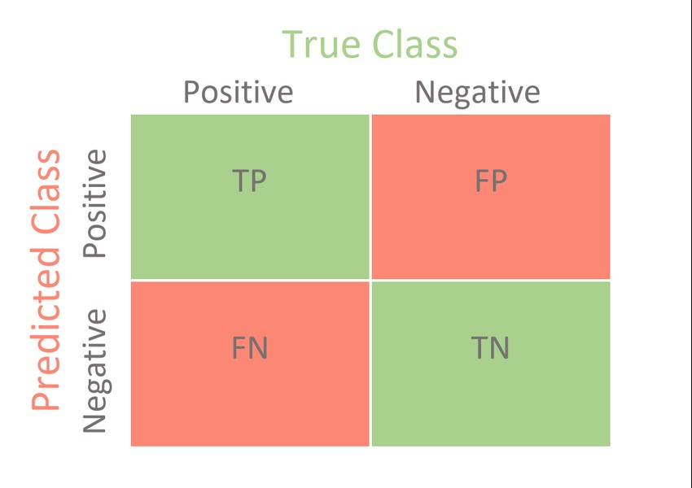
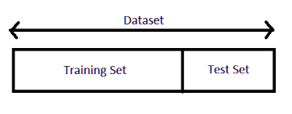

La siguiente clase versará sobre los siguientes ejes: 

+ `Evaluación de modelos`

+ `Overfitting y underfitting`

+ `Sesgo y varianza`

+ `Parametros/hiperparámetros`

+ `Balanceo de dataset`

- - -

# **Evaluación de modelos**

Comencemos por el primero de ellos. En todo nuestro flujo de trabajo, donde estaremos creando modelos, entrenándolos y utlizándolos para predecir, pasaremos posteriormente a la etapa de evaluación. Es decir, poder determinar su calidad o performance.

Una correcta evaluación debe suplir las siguientes aristas:

1. Elección de la métrica

2. Tomar en consideración el tipo de problema. La performance será buena o mala dependiendo de ello y del modelo benchmark (un modelo base o punto de referencia) que tengamos

3. Corroborar su poder de generalización. Es decir, que logre un nivel de abstracción suficiente como para generalizar por fuera de los datos que el modelo ya ha visto

## ***Evaluación de modelos de clasificación***

Para evaluar la performance de un modelo de clasificación -como, por ejemplo, un árbol de decisión o un K-NN- podemos emplear diversas métricas.

Entre ellas, tenemos:

+ Matriz de confusión

+ Precisión/Exactitud (accuracy)

+ Exhaustividad (recall)

+ F-score

+ Curva ROC

Para explicar cada una, debemos comenzar por la matriz de confusión. Recibe ese nombre porque, a través de la matriz, podemos identificar fácilmente dónde el modelo está confundiendo las clases.

Prestemos atención a esta matriz para una clasificación binaria. En el eje *y* tenemos las etiquetas predichas, mientras que en el eje *x* las etiquetas reales. En color verde se encuentran los casos en los que el modelo predijo correctamente las etiquetas. Es decir, valor real y predicho coinciden. En cambio, el naranja representa a las etiquetas que el modelo clasificó erróneamente.

Quizás el siguiente [video](https://www.youtube.com/watch?v=r5WIImKV1XA&ab_channel=AprendeIAconLigdiGonzalez) te pueda servir si todavía no has logrado comprender la esencia de la *confusion matrix*.

De esta matriz se van a desprender todas nuestras métricas. La utilización de una u otra estará directamente relacionada con la naturaleza de nuestro problema. Según lo que estemos queriendo predecir, nos importará más una métrica determinada.

Por ejemplo, sería más grave decirle a un paciente que no está enfermo cuando en realidad lo está que a la inversa. Del mismo modo, sería más preocupante que un correo importante sea clasificado como spam a que un correo no deseado te llegue a tu bandeja de entrada.

Muchas veces nos enfrentaremos a escenarios en donde debemos priorizar una clase sobre otra. Piénsese en test de COVID, test de embarazos, etc. A veces, es mejor tener un falso positivo que un falso negativo.

Ahora pasemos a ver cómo se desprenden, de la matriz de confusión, las diversas métricas que podemos emplear para los modelos de clasificación. Luego, procederemos a explicarlas.

+ `Precisión`: hace referencia a los resultados *correctos* sobre el total de muestras seleccionadas. Es decir, los verdaderos positivos sobre los verdaderos positivos + los falsos positivos. En otras palabras, indica cuánto acertó el modelo dentro de todo el universo de personas a las que les indicó que estaban enfermas.

+ `Exhaustividad (sensibilidad o recall)`: se refiere a los resultados *correctos* por sobre todos los resultados que buscamos identificar. Es decir, verdaderos positivos sobre los verdaderos positivos + falsos negativos. De todo el universo de personas enfermas, ¿a cuántas identificó el modelo?

+ `Especificidad`: indica, de todas las personas sanas, a cuántas identificó el modelo. Se le da mayor relevancia, aquí, a los verdaderos negativos.

El valor de estas métricas oscila entre 0 y 1. Como dijimos, la importancia que le demos a una por sobre otra dependerá del problema y su naturaleza.

Finalmente, también se puede utilizar una métrica que combina precisión y exhaustividad de forma tal de mantener una relación entre las dos. Por ello, esta métrica combina ambas de forma tal de no aumentar mucho una en detrimento de la otra.

Si la precisión o el recall son bajos, también lo será F-Score. Mientras que, si las dos son altas -cercanas a 1-, también lo será F-Score.

[Aplicación breve de métricas de clasificación con un ejemplo](https://www.iartificial.net/precision-recall-f1-accuracy-en-clasificacion/)

### **`Curva ROC`**

Este tema en particular puede resultar un poco tedioso, ya que incorpora algunas de las métricas que estuvimos viendo recientemente y las entrelaza. Por este motivo, recomendamos ver el siguiente [video explicativo](https://www.youtube.com/watch?v=AcbbkCL0dlo&ab_channel=AprendeIAconLigdiGonzalez) para comenzar el abordaje con un poco más de claridad.

También aconsejamos ver el siguiente [video](https://www.youtube.com/watch?v=TmhzUdPpVPQ&t=62s&ab_channel=HablandoEnData) donde se aplica un ejemplo muy didáctico.

Aquí veremos una de las métricas fundamentales para los modelos de clasificación binaria.

Esta métrica nos indica cuán bien puede distinguir el modelo entre dos clases.

La curva ROC es una representación gráfica de la relación entre las tasas de falso positivo (**FPR**) y las tasas  de verdadero positivo (**TPR**).

Se utiliza con frecuencia para mostrar, precisamente de forma gráfica, la conexión / compensación entre la sensibilidad y la especificidad.

$TPR = TP / (TP + FN)$

$FPR = FP / (FP + TN)$

**TPR** : describe qué tan bueno es el modelo para predecir la clase positiva cuando el resultado real es positivo.

**FPR** : también denominado tasa de falsas alarmas, ya que resume la frecuencia con la que se predice una clase positiva cuando el resultado real es negativo.

Un concepto esencial está dado por AUC -área bajo la curva ROC-. 

+ Un modelo excelente tendrá un AUC = 1.

+ El el azar tendrá un AUC = 0.5 

+ Con un AUC = 0 tendremos un modelo que clasifica todas las etiquetas al revés

El área bajo la curva indica la probabilidad de que el modelo sea capaz de distinguir entre una clase y la otra.

En el siguiente [link](https://www.bioestadistica.uma.es/analisis/roc1/) podrán ver cómo se irá desplazando la curva a medida que modificamos ciertos valores.

*Aclaración: las métricas para los problemas de regresión podrán encontrarlas en la Práctica_01 de la clase 1.*

- - - 

## **Overfitting y underfitting**

Antes de entrenar nuestro modelo, debemos separar una fracción del dataset para poder testear el modelo. Este modelo será entrenado con los datos de train y evaluado con los datos de test. 

Scikit-learn realiza esto por nosotros con el método **train_test_split**.

Piénsenlo de la siguiente manera. Si tienen que rendir un checkpoint -llamémosle testeo-, debemos entrenar. Para ello, nuestro set de entrenamiento serán las homeworks. Para un modelo de Machine Learning, no hacer la separación de datos equivale, en este ejemplo, a que nosotros supiéramos de antemano cómo serán las preguntas del checkpoint -etiqueta de entrada- y sus respuestas -etiqueta de salida-. Entonces, entrenaríamos no solo con las homeworks sino también con los datos propios de testeo, es decir, el checkpoint. Obviamente, al ya haber estudiado con el propio checkpoint es de esperar que obtengamos una alta performance o accuracy en la evaluación, ¿no?
La idea, en esencia, es que entrenemos con las homeworks y veamos qué tanto verdaderamente hemos aprendido cuando tengamos que testearnos con el checkpoint.

Lo mismo sucede con los modelos de ML. Si entrena con todos los datos, luego lo estaremos evaluando con los propios datos que ya entrenó. La idea es poder ver su poder de generalización y abstracción para cuando salga a producción. Entonces, tenemos que hacer una división del dataset en un subset de entrenamiento y otro de testeo.

Una vez aclarado esto, pasemos a ver de qué se trata el sobreajuste y el subajuste.

### ***Overfitting***

Escenario que se presenta cuando nuestro modelo está demasiado ajustado a los datos. Dicho en otros términos, el modelo se *aprendió los datos de memoria*, pero no aprendió a generalizar. Cuando se da el sobreajuste, el modelo va a dar buenos resultados con los datos de entrenamiento, pero no va a funcionar tan bien para los datos nuevos que no haya visto.

### ***Underfitting***

Escenario que se presenta cuando el modelo establece una línea divisoria demasiadio generalista. Tendrá un bajo desempeño para hacer una predicción tanto con los datos de muestreo como los poblacionales.

Vale aclarar que estos dos términos no son absolutos. Cada uno se encuentra en un extremo dentro de un contínuum.

En el gráfico de la izquierda, podemos apreciar cómo el modelo estableció una recta que no logra captar el patrón o la tendencia de los datos. Por el contrario, la tercera gráfica muestra cómo el modelo se adaptó extremadamente a los datos. Finalmente, el gráfico del medio representa la curva que tiene mayor poder de generalización ¿Qué modelo elegirías de los tres?

### ***Entrenamiento, validación y test***

Una extensión del clásico _train-test split_ es lo que se llama entrenamiento, validación y testeo. Primero se divide el dataframe entre entrenamiento y validación, y se deja un conjunto de datos llamados de testeo. Una vez entrenado nuestro modelo, validaremos su performance en el set de validación una $x$ cantidad de veces, donde $x$ no debe ser un número entero muy grande (si bien depende, 5 ya sería mucho). Ahora bien, con nuestro modelo entrenado y validado, vamos al test set y lo testeamos. El test set debe utilizarse **SOLAMENTE** una vez, no dos, una vez. Es una buena práctica tener varios set de testeos, ya que una vez usados pueden convertirse en validación, pero no volverse a usar como set de testeo.

- - -

## **Sesgo y varianza**

En este apartado veremos dos conceptos fundamentales que vienen de la Estadística tradicional.

Por un lado, decimos que un conjunto de números tiene mucha *varianza* cuando están muy dispersos respecto a su media. Por otro lado, el *sesgo* se suele usar para referirnos a estimadores que están por encima o por debajo de lo que deberían dar.

Ahora bien, la *varianza* no es solo una medida estadística. Sino, tambíen, una propiedad de los estimadores.

Cuando hablamos de estimadores a partir de un cierto conjunto de datos, nos estamos refiriendo generalmente a la media, mediana, percentiles, varianza, etc. Estos estimadores tienen sesgo y varianza.

Buena parte de la Estadística ha estado ligada a la creación de estimadores **no sesgados** y de **mínima varianza**. Esto es extrapolable a los modelos de Machine Learing, ya que ellos también trendrán su dosis de sesgo y varianza.

|Bias|Variance|
|--|--|
|Lo introducimos al intentar explicar un problema al que le correspondería un modelo complejo con uno simple|Es la cantidad en la que cambiaría la predicción si hubiera entrenado al modelo con otros datos|
|Asociado al underfitting|Asociado al overfitting|

Tenemos cuatro combinaciones posibles con estos estimadores:

+ Bajo sesgo y alta varianza: escenario de overfitting

+ Alto sesgo y baja varianza: escenario de underfitting

+ Alto sesgo y alta varianza: peor de los escenarios posibles

+ Bajo sesgo y baja varianza: escenario ideal

- - -

## **Parámetros/hiperparámetros**

En este segmento introduciremos una diferenciación fundamental entre estos dos conceptos. Veamos un poco a qué se refieren cada uno de ellos.

+ `Parámetros`: son las variables que se estiman durante el proceso de entrenamiento con los conjuntos de datos. Definen cómo usar los datos de entrada para obtener la salida deseada. Se aprenden en el momento que se realiza el entrenamiento del modelo. En definita, los valores de los parámetros no los indica manualmente el data scientist, sino que son obtenidos. Es decir, los ajusta el modelo por sí solo. Ejemplo de parámetros: ordenada al origen y pendiente -regresión lineal- o valor del índice de Gini en una hoja -árbol de decisión-.

+ `Hiperparámetros` : es el parámetro cuyo valor se define **antes** de que el modelo comience a entrenarse. En este caso, el data scientist los define explícitamente para controlar el proceso de aprendizaje. Estos hiperparámetros se utilizan para, precisamente, mejorar el aprendizaje del modelo. Ejemplos de hiperparámetros: cantidad de vecinos - K-NN- o profunidad del árbol -árbol de decisión-. 

Ya veremos que existen diversas técnicas para encontrar las mejores combinaciones de hiperparámetros, dentro de lo que se conoce como *optimización de hiperparámetros*.
- - - 

## **Balanceo de dataset**

Finalmente, ¡llegamos al último tema del día!

Como siempre, tenemos un [video](https://www.youtube.com/watch?v=TJJOz6thSfk&ab_channel=AprendeIAconLigdiGonzalez) para recomendarles antes de abordar de lleno la temática y que les puede ser de utilidad. 

En determinadas ocasiones, nos enfrentaremos a datasets que están desbalanceados. Esto significa que habrá una prevalencia de una clase por sobre otra. Pensemos en un dataset que contenga transacciones fraudulentas con tarjetas de crédito. Como la gran mayoría de las operaciones no corresponden a esa categoría, tendremos -en términos relativos- una subrepresentación de esta clase.
Cuando entrenemos el modelo, casi la totalidad de datos que verá corresponderán a una de las clases. Lo mismo sucederá en la etapa de testeo.

Esto puede confundirnos, porque si evaluáramos el modelo con una métrica como accuracy, indefectiblemente esta será alta. Pero se debería a que, por más de que no haya identificado prácticamente ninguna etiqueta de la que verdaderamente nos importa predecir (*fraude*), probablemente acierte en casi todas las transacciones que no fueron fraudulentas. De este modo, al haber tan pocas instancias que corresponden a la clase *fraude*, el modelo tendrá una alta exactitud. 

Este sería uno de los casos en los que, claramente, la elección de la métrica cambiará ostensiblemente nuestra percepción sobre la calidad del modelo.

¿Cómo hacemos para tratar con un dataset desbalanceado?

Bien, a grandes rasgos tenemos dos posibilidades concretas.

 **`1. Oversampling`**

Acá realizaremos un sobremuestreo, es decir, incorporaremos más datos de la clase minoritaria. En caso que no podamos obtenerlos de alguna fuente externa, se soluciona simplemente copiando registros que corresponden a esa categoría en nuestro propio dataset.

**`2. Upsampling`**

Acá realizamos un submestreo de la clase mayoritaria. Es decir, eliminamos registros de nuestro dataset que contengan como etiqueta o variable de salida aquella clase hegemónica o predominante.

- - -
 Suficiente por hoy ¡Llegó el momento de pasar a la práctica!

